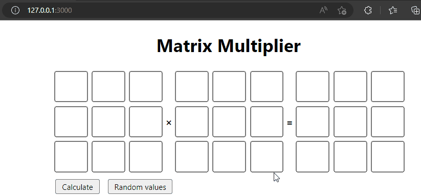

# About 
This repository contains an experiment to conduct distributed matrix multiplication computing using multiple docker containers in a network. 

### Frontend UI

<i>Simple frontend UI</i>

### Under the hood

<i>Multiplication task distributed between nodes in the network</i>

# Instructions
Run <code>docker compose up</code> to build the environment, then navigate to <code>http://localhost:3000/</code>